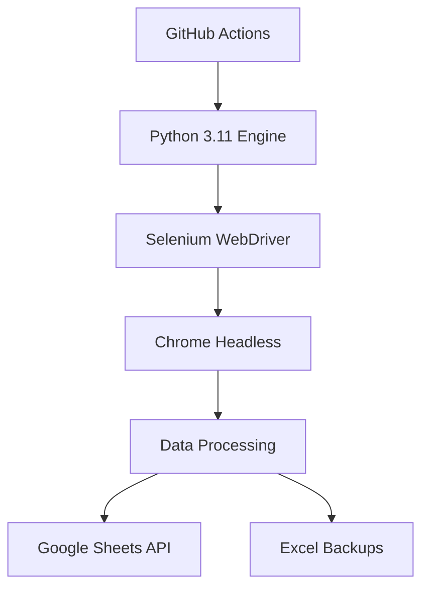

<div align="center">

# 🚗 Plataforma de Scrapeo de Coches en Wallapop

<p>


</p>

### Sistema de extracción y automatización de datos en coches de Wallapop

</div>

---

## 🎯 Descripción General

> **Plataforma de Automatización de Datos Vehiculares Wallapop** es una solución empresarial diseñada para extraer, procesar y organizar sistemáticamente datos de inventario de coches de concesionarios profesionales en el marketplace de Wallapop.

<table>
<tr>
<td width="50%">

**🔍 Extracción Inteligente**

- Monitoreo continuo automatizado
- Más de 15 concesionarios profesionales
- Procesamiento de 5.000+ anuncios diarios

</td>
<td width="50%">

**☁️ Integración Cloud**

- Exportación directa a Google Sheets
- Infraestructura GitHub Actions
- Operación completamente autónoma

</td>
</tr>
</table>

---

## 🏗️ Arquitectura Técnica

<div align="center">



</div>

<details>
<summary><strong>🔧 Componentes del Sistema</strong></summary>

```bash
Entorno de Producción
├── 🚀 GitHub Actions (Pipeline CI/CD)
├── 🐍 Python 3.11 (Motor de Procesamiento)
├── 🌐 Selenium WebDriver (Automatización de Navegador)
├── 📊 Google Sheets API (Almacenamiento de Datos)
└── 🖥️ Chrome Headless (Motor de Renderizado)
```

</details>

---

## ⚙️ Pipeline de Procesamiento

<div align="center">

| Fase | Proceso | Descripción |
|------|---------|-------------|
| **1️⃣** | **Monitoreo** | Escaneo automatizado de concesionarios |
| **2️⃣** | **Extracción** | Recuperación de datos vehiculares |
| **3️⃣** | **Normalización** | Estandarización de formatos |
| **4️⃣** | **Validación** | Verificación de calidad |
| **5️⃣** | **Exportación** | Subida a Google Sheets |
| **6️⃣** | **Backup** | Generación de artifacts |

</div>

---

## 🛠️ Configuración

### 📋 Prerrequisitos

<div align="center">

| Requisito | Estado | Descripción |
|-----------|--------|-------------|
| GitHub Actions | ✅ | Repositorio con Actions habilitado |
| Google Cloud | ✅ | Proyecto con Sheets API |
| Service Account | ✅ | Credenciales con permisos apropiados |

</div>

### 🔧 Instrucciones de Configuración

<details>
<summary><strong>☁️ Configuración Google Cloud</strong></summary>

```bash
# Habilitar APIs requeridas
gcloud services enable sheets.googleapis.com
gcloud services enable drive.googleapis.com

# Crear cuenta de servicio
gcloud iam service-accounts create wallapop-scraper-bot \
    --display-name="Cuenta de Servicio Wallapop Scraper"
```

</details>

<details>
<summary><strong>🔐 Configuración GitHub Secrets</strong></summary>

**Ubicación:** `Repositorio → Settings → Secrets and Variables → Actions`

| Secret | Descripción |
|--------|-------------|
| `GOOGLE_CREDENTIALS_JSON` | Credenciales JSON completas |
| `GOOGLE_SHEET_ID` | ID del documento objetivo |

</details>

<details>
<summary><strong>📊 Configuración Google Sheets</strong></summary>

1. **Crear** nuevo documento Google Sheets
2. **Compartir** con email de cuenta de servicio (Editor)
3. **Extraer** Sheet ID de la URL
4. **Configurar** como secret `GOOGLE_SHEET_ID`

</details>

---

## 🚀 Operación

### ⏰ Ejecución Automatizada

<div align="center">

**📅 Programación:** Diario a las **08:00 UTC**  
**🤖 Intervención:** Sin requerimiento manual

</div>

### 🎮 Ejecución Manual

```
📍 Ubicación: Repositorio → Actions → Wallapop Scraper Automation → Run workflow
```

<table>
<tr>
<td align="center" width="50%">

**🧪 Modo Prueba**  
*Validación de alcance limitado*  
Un solo concesionario

</td>
<td align="center" width="50%">

**🏭 Modo Producción**  
*Extracción completa*  
Todos los concesionarios

</td>
</tr>
</table>

---

## 🏢 Red de Concesionarios

<div align="center">

**📊 Monitoreo Actual:** `18 concesionarios profesionales` en toda España

</div>

<details>
<summary><strong>🥇 Grupo 1 - Concesionarios Principales</strong></summary>

| Concesionario | Volumen Aprox. |
|--------------|----------------|
| DURSAN D. | ~50 anuncios |
| Beatriz D. | ~100 anuncios |
| GESTICAR G. | ~200 anuncios |
| Garage Club C. | ~150 anuncios |

</details>

<details>
<summary><strong>🥈 Grupo 2 - Concesionarios Secundarios</strong></summary>

| Concesionario | Volumen Aprox. |
|--------------|----------------|
| Red MundiCars | ~800 anuncios |
| OCASIONPLUS E. | ~1.500 anuncios |
| Red CRESTANEVADA | ~1.200 anuncios |

</details>

<details>
<summary><strong>🥉 Grupo 3 - Gran Volumen</strong></summary>

| Concesionario | Volumen Aprox. |
|--------------|----------------|
| GRUPO O. | ~2.000+ anuncios |
| INTEGRAL MOTION | ~1.000 anuncios |
| Otros regionales | Variables |

</details>

---

## 📈 Métricas de Rendimiento

<div align="center">

| Métrica | Valor | Descripción |
|---------|-------|-------------|
| **📊 Capacidad** | `5.000+` | Anuncios por ejecución |
| **🎯 Precisión** | `95%+` | Completitud de datos |
| **⏱️ Tiempo** | `2-4h` | Ejecución completa |
| **🛡️ Fiabilidad** | `99%+` | Finalización exitosa |

</div>

---

## 🔍 Monitoreo del Sistema

### 📋 Logs de Ejecución
> Procesamiento en tiempo real mediante interfaz GitHub Actions con seguimiento detallado

### 🛠️ Manejo de Errores
- **🔄 Reintentos automáticos** para extracciones fallidas
- **🌐 Manejo de timeouts** de red elegante  
- **✅ Validación de datos** y corrección automática

### 💾 Sistemas de Backup
- **📁 Excel automatizado** (30 días retención)
- **🔄 Control de versiones** completo
- **↩️ Rollback capabilities** para recuperación

---

## 🔧 Mantenimiento

<table>
<tr>
<td width="50%">

### 🆙 Actualizaciones Automáticas
- Dependencias via Dependabot
- Parches de seguridad GitHub Actions  
- Compatibilidad de navegador

</td>
<td width="50%">

### ⚙️ Gestión de Configuración
- Control de versiones
- Seguimiento de cambios
- Flujos de aprobación

</td>
</tr>
</table>

---

## 📞 Soporte y Documentación

### 🛎️ Soporte Técnico
- **📝 Issues:** GitHub Issues con triage automatizado
- **📚 Docs:** Documentación inline comprehensiva  
- **📋 Changelog:** Historial detallado de versiones

### 📧 Contacto
> Para consultas técnicas utilizar sistema **GitHub Issues**

---

## 📄 Licencia

> **Software Propietario** - Desarrollado para operaciones comerciales internas  
> Todos los derechos reservados

---

<div align="center">


**Plataforma de Automatización de Datos Vehiculares**  
*MOTICK.COM*

**Versión 12.3** • **Agosto 2025**

</div>
